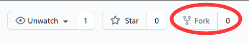
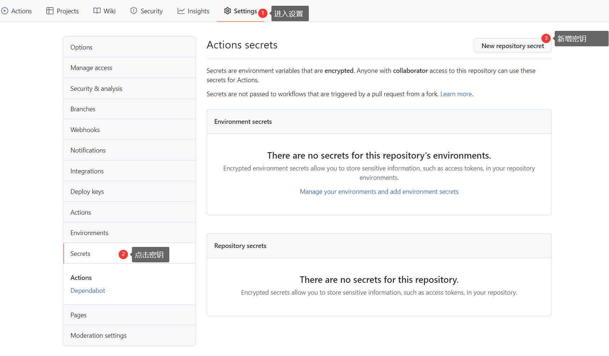
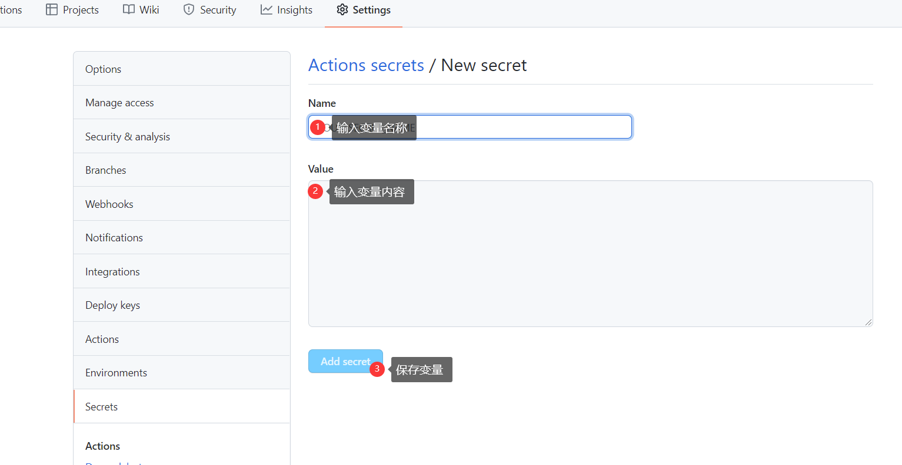
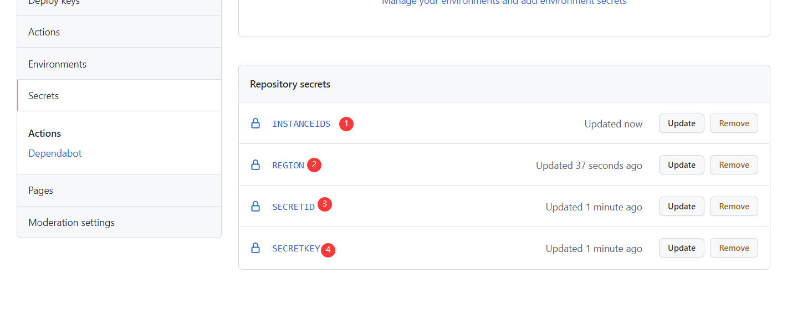
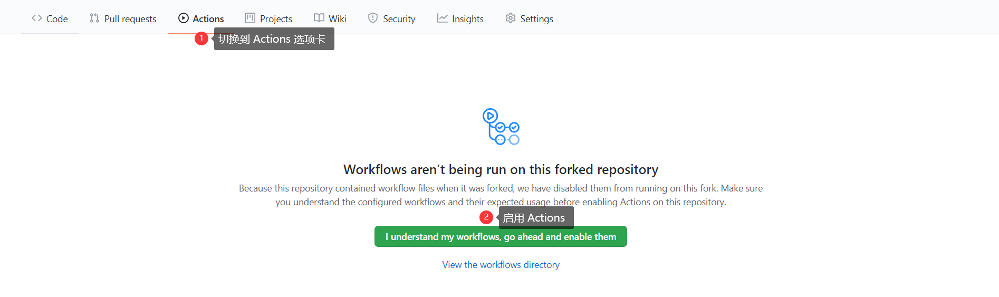

## 部署指南

### 一、Fork 此仓库
点击项目右上角的 fork 按钮即可\



### 二、配置参数
为项目运行设置必要参数
> 设置路径: Settings-->Secrets-->New repository secret



支持多实例监控备份, 
每个实例之间使用`#`分隔



配置共4个必要参数



### 三、启用 Actions
首先切换到 Actions 选项卡\
再点击 **I understand my workflows, go ahead and enable them** 按钮即可启用 Actions



### 四、触发 Actions
1. 当启动 Actions 之后, GitHub 会在按照设定时间自动执行任务
2. 你也可以通过点击右上角的 Star 按钮手动立即触发 Actions 事件


### 五、运行日志
在 Actions 选项卡中可以浏览所有 Actions 运行记录\
点击任意记录 ```Auto run -> run -> 执行任务```, 即可查看运行日志信息
